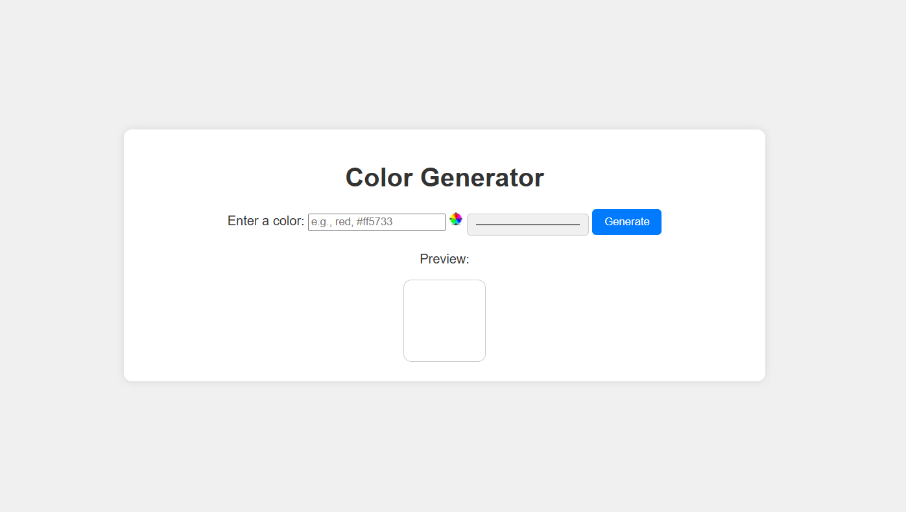

# 🎨 Color Generator

A simple and interactive color generator that allows users to generate random colors with their hex codes using HTML, CSS, and JavaScript.

## 🚀 Live Demo

🔗 [Live Demo](https://colorgenerator-khushicode.netlify.app/)


## 🛠 Technologies Used

- **HTML** - For structuring the webpage
- **CSS** - For styling the UI
- **JavaScript** - For generating random colors dynamically

## 📂 Project Structure
```
├── index.html   # Main HTML file
├── style.css    # Styling file
├── script.js    # JavaScript functionality
└── README.md    # Project documentation
```

## 📥 Installation

1. **Clone the repository:**
   ```bash
   git clone https://github.com/yourusername/color-generator.git
   ```
2. **Navigate to the project folder:**
   ```bash
   cd color-generator
   ```
3. **Open `index.html` in your browser.**

## 🎨 Usage

1. Click the **"Generate Color"** button to get a random color.
2. The background will change to the generated color.
3. The hex code of the color will be displayed.

## 📸 Website Preview

[](https://colorgenerator-khushicode.netlify.app/)

## 💡 Features
✅ Generates random colors
✅ Displays the corresponding hex code
✅ Simple and user-friendly UI


